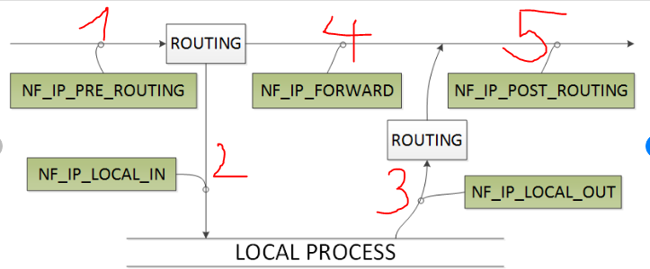
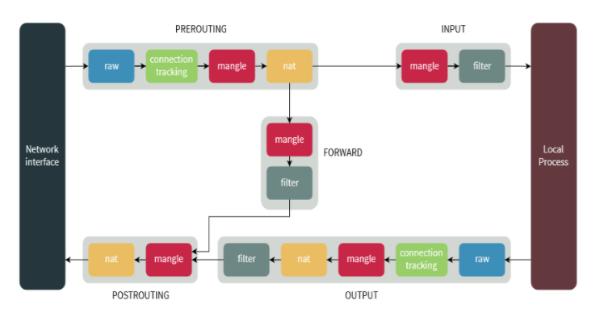

# Firewall
## 1. Khái niệm firewall
Linux firewall là một thiết bị để kiểm tra network traffic (In/Out) và đưa ra quyết định chặn hay cho qua. Trong hệ điều hành Linux, tường lửa được thực thi tốt nhất bằng cách sử dụng netfilter. Đây là một kernel module quyết định packet nào được phép đi vào (input) hoặc đi ra bên ngoài (output).

## 2. Hoạt động của firewall
### 2.1 Firewall: stateless and stateful filtering mechanisms
**Packet filtering** : Các giao tiếp trong mạng thường chia nhỏ thành các phân đoạn thành packet nhỏ (MTU) 1500byte (thường thế). Và ở mỗi `header` có những thông tin để có thể xử lý. Packet filtering là cơ chế làm nhiệm vụ phân tích các `header` của các layer trong tcp/ip, dựa vào những rule mà admin đặt ra để có thể "cho qua" hoặc "chặn lại". *Kiểm tra gói tin dựa vào các thông tin: src des IP, src des port, protocol*
- *Stateless filtering*: Đánh giá các gói tin 1 cách độc lập. Có nghĩa là tất cả các gói tin qua mạng mới hay cũ đều phải áp dụng rule được định sẵn. Cơ chế này tạo ra quy tắc cho lưu lượng, tức là đầu vào thế này -> thì đầu ra phải thế này. Cơ chế áp dụng cho các kết nối với các mạng khác nhau, vì mạng này ko thể có dữ liệu về mạng khác từ trước được. => nhanh hơn *stateful filter*
- *Stateful filtering*: Được tạo ra để giải quyết các vấn đề bảo mật (ex: spoof MAC,..). Cơ chế filter này dựa trên một cơ sở để filter gọi là : `connection table` or `status table`. Với `status table` mỗi connection đều được register. Khi 1 packet gửi đến trước khi áp rule, `stateful firewall` sẽ check trong `status table` xem là đã có kết nối nào hay chưa, nếu đã có và hợp lệ thì cho qua, ko cần áp rule lên, nếu ngược lại thì chặn.

**Netfilter**: là một framework của kernel cho phép các ứng dụng tương tác với packet. Netfilter hooks:

> Những hooks này thực thi trực tiếp với linux kernel
- `NF_IP_PRE_ROUTING`: Đưa ra cách quyết định xử lý với một packet ngay khi tới network interface. Ở đây có thể drop packet, NAT, hoặc đơn giản là để nó tự đi qua.
- `NF_IP_LOCAL_IN`: Chứa các rule để kiểm soát truy cập từ internet, ví dụ như muốn chặn hay mở port từ IP khác đến. 
- `NF_IP_FORWARD`: Chịu trách nhiệm forward các packet như là bộ định tuyến.
- `NF_IP_LOCAL_OUT`: Chịu trách nhiệm cho quá trình truy cập ra bên ngoài, ví dụ như để quản lý các packet gửi ra bên ngoài, bạn ko thể gửi gói tin ra ngoài mà chưa được phép ấy.
- `NF_IP_POST_ROUTING`: Đây là nơi mà packet đi ra khỏi máy tính của mình. 

Các trường hợp packet sẽ đi và qua hooks (Chain Traversal Order) như sau:
- `1-2`: Gói tin được gửi đến máy của bạn, và ở LOCAL_IN sẽ có rule để có chấp nhận `packet` hay không
- `1-4-5`: Máy của bạn được coi như là bộ định tuyến (router)
- `3-5`: Máy của bạn gửi gói tin ra bên ngoài.

## 3. Các loại firewall
- Firewalld, ufw đều là những công cụ giao diện để điều khiển iptables, tuy nhiên nó không đầy đủ chức năng (Chức có những chức năng NAT, log,..). Nên ta tìm hiểu về iptables.
- Iptables thực chât là giao diện để admin tương tác với netfilter. Hiểu là iptables là frontend và netfilter là backend.

## 4. Cấu trúc firewall
### 4.1 Cấu trúc Iptables:
- **chain**: Có 5 chain trong iptable, Mỗi chain tương ứng với netfilter hooks chịu trách nhiệm với packet: `PREROUTING`, `INPUT`, `FORWARD`, `OUTPUT` và `POSTROUTING`.
- **table**: Các table có nhiệm vụ khác nhau :  `filter`, `nat`, `mangle`, `raw` và `security`. table nat (NAT) chịu trách nhiệm chuyển đổi địa chỉ mạng.
- **target**: Chỉ định trạng thái của packet: `ACCEPT`, `DROP`, `RETURN`, `DNAT`, `LOG`, `MASQUERADE`, `REJECT`, `SNAT`, `TRACE` và `TTL`. 
### 4.1 Chain iptables
Nó giống như `netfilter hooks` thôi. khác cái tên thôi, iptables thực hiện trên user space gọi xuống netfilter thực hiện trong linux kernel.
### 4.2 Table iptables
Trong mỗi `table` sẽ có những `chain` nhất định được sử dụng. Bảng table được mặc định nếu ko chỉ định. Vì là bảng dùng nhiều nhất.
| Tables↓/Chains→ | PREROUTING | INPUT | FORWARD | OUTPUT | POSTROUTING |
|-----------------|------------|-------|---------|--------|-------------|
| filter | | ✓ | ✓ | ✓ | |
| nat (DNAT) | ✓ | | | ✓ | | |
| nat (SNAT) | | ✓ | | | ✓ |
| mangle |  ✓ | ✓ | ✓ | ✓ | ✓ |
| raw | ✓ |  |   | ✓ | 
| security | | ✓ | ✓ | ✓ | |

- `filter`:Trong table này, bạn sẽ quyết định xem packet có được phép vào (input) hoặc ra (output) khỏi máy tính của bạn hay không
- `nat`: nat gồm 2 loại: DNAT : Thay đổi địa chỉ đến của của gói dữ liệu khi cần thiết, SNAT: Thay đổi địa chỉ nguồn của gói dữ liệu khi cần thiết.
- `mangle`: Thay đổi các bit dịch vụ trong IP header: TTL (Time to live), TOS (Type of service)...
- `raw`: xử lý packet raw chưa qua xử lý. Chủ yếu là để theo dõi trạng thái kết nối.
- `security`: là bảng được sử dụng cho Mandatory Access Control (MAC) - kiểm soát truy cập bắt buộc đối với các rule về network. Có nhiệm vụ đánh dấu những gói tin có liên quan đến context của SELinux, xử lý gói tin.

### 4.3 Target iptables
Hành động áp dụng cho các gói tin được gọi là `target`.
- ACCEPT: chấp nhận gói tin, cho phép gói tin đi qua hay đi vào hệ thống.

- DROP: loại bỏ gói tin, không phản hồi lại gói tin giống như việc gói tin đó được gửi đến một hệ thống không tồn tại.

- RETURN: Dừng thực thi xử áp dụng rules tiếp theo trong chain hiện tại đối với gói tin. Việc kiểm soát sẽ được trả về đối với chain đang gọi.

- REJECT: Thực hiện loại bỏ gói tin và gửi lại gói tin phản hồi thông báo lỗi. Ví dụ: 1 bản tin “connection reset” đối với gói TCP hoặc bản tin “destination host unreachable” đối với gói UDP và ICMP.

- LOG: Chấp nhận gói tin và có ghi lại log.

```
Tóm lại ta sẽ hiểu là: Mỗi table có nhiều chain, mỗi chain có nhiều rule, mỗi rule lại có 1 target.
Ví dụ: table filter có INPUT chain, và chain INPUT có rule là chỉ địa chỉ 1.2.3.4 mới được qua. và target là ACCEPT.
```

## 5. Cách triển khai firewall trong thực tế


## 6. Thực hành với iptables