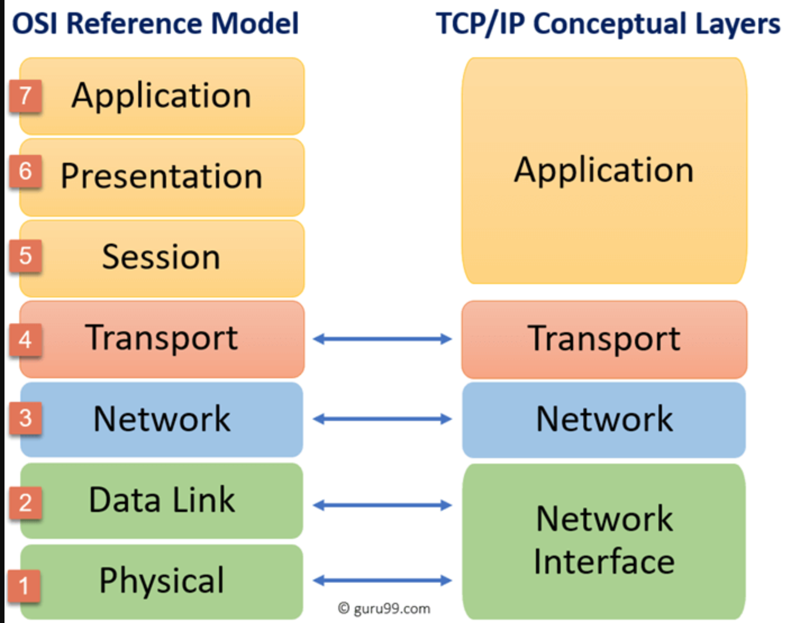
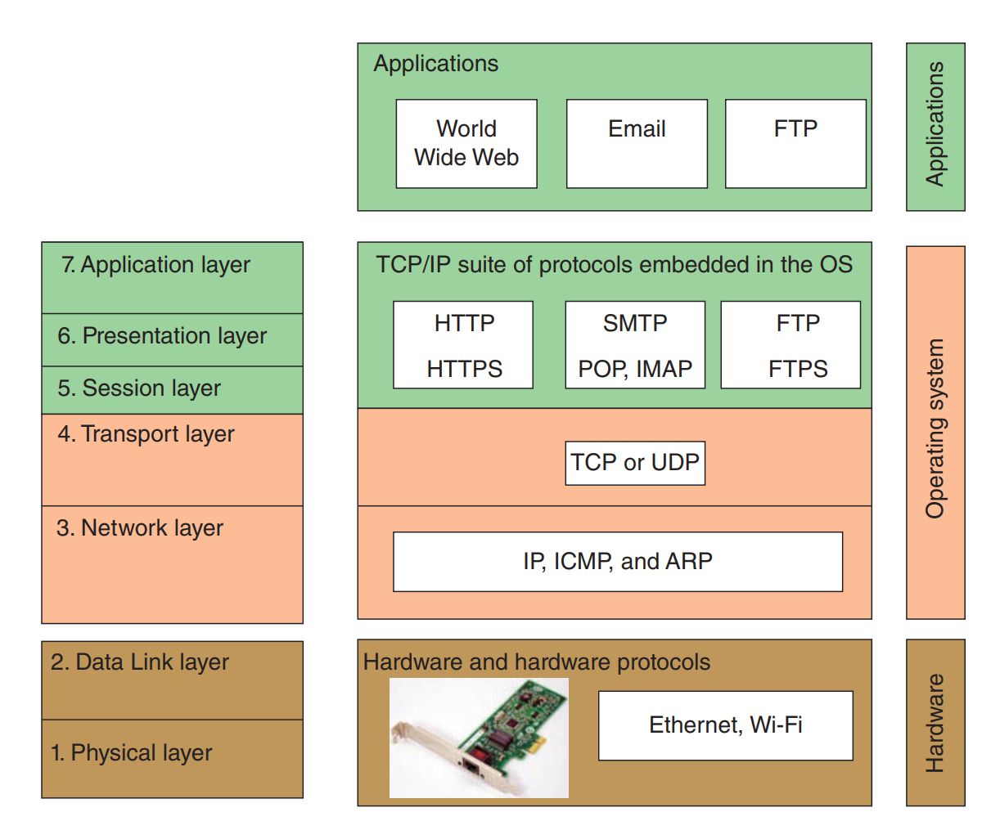
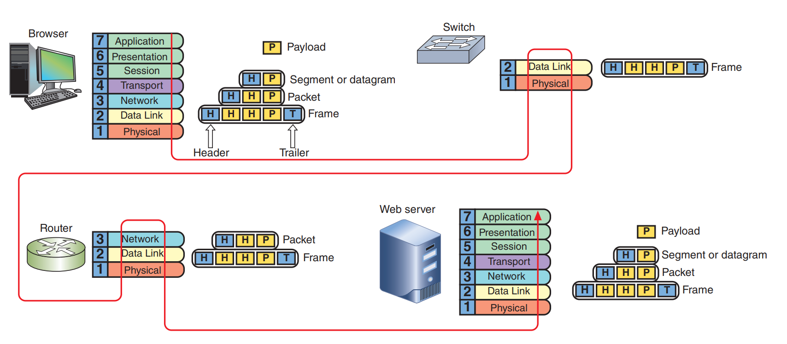

# **TCP/IP vs OSI**

## 1. What is TCP/IP & OSI

+ OSI : Mô hình OSI là cách thức truyền tin từ các ứng dụng của hệ thống này đến ứng dụng của hệ thống khác thông qua phưong tiên truyền thông vật lý. Có 7 layer => Mục đích là làm rõ ràng các cách thức trao đổi thông tin giữa các thiết bị với nhau. Thường dùng trong học tập, nghiên cứu, trace lỗi.

+ TCP/IP : TCP/IP là giao thức ra đời trước Osi. là một bộ các giao thức truyền thông được sử dụng để kết nối các thiết bị mạng với nhau trên internet, mạng nội bộ. Có 4 layer 

> Tại sao phải chia thành 2 mô hình này ?

Việc chuẩn hoá các giao thức này tuỳ thuộc vào các nhà cung cấp mạng router, switch, lập trình phần mềm sẽ căn cứ vào mô hình TCP/IP nhiều hơn. Ví dụ : Ông lập trình phần mềm, hệ điều hành sẽ làm các chức năng 5-6-7 của OSI => Application của TCP/IP, còn về Datalink là về switch và Physical là về card mạng hoặc cable thì họ gom thành network interface của mô hình TCP/IP. 

## 2. Chức năng thành phần layer

### 2.1 OSI

**Layer 7 Application** : Là lớp miêu tả giao diện giữa 2 ứng dụng, nằm ở 2 thiết bị khác nhau. Các giao thức ở lớp ứng dụng như là : http, https, ftp, smtp, telnet, pop3,... Giao thức L7 được sử dụng các chưong trình gồm 2 loại :
- Các chương trình ứng dụng cung cấp cho end-user : web browser và máy chủ sử dụng các giao thức http,https
- Các chương trình dịch vụ hệ thống : SNMP thu thập và monitor thông tin đường truyền mạng. 

Dữ liệu ở tầng này được gọi là `payload`. Các thiết bị giao tiếp với nhau ở L7 gọi là `host`.

**Layer 6 Presentation** : Nhìn chung thì lớp này sử dụng để định dạng nén. Ví dụ : Email bạn gửi đi dạng text : L6 sẽ chuyển nó thành dạng nén. -> Tý nữa sẽ có phần về Encapsulation và Decapsulation sẽ rõ hơn.

**Layer 5 Session** : Mô tả cách dữ liệu giữa các host được đồng bộ hoá và khôi phục nếu như các message đến application bị thiếu. Ví dụ: Ứng dụng gọi nhau đang hoạt động trên 1 phiên (session) néu như video vẫn đang chạy.

*Những tác vụ ở 3 lớp này thường khó phân biệt và rất ít khi thực hiện riêng lẻ Hầu hết là cả 3 lớp cùng được thực hiện bởi Os khi mà call api đến*

**Layer 4 Transport** : Có trách nhiệm là truyền `payload` từ tầng ứng dụng này sang tầng ứng dụng khác. Cung cấp các tiến trình thường sử dụng giao thức TCP và UDP. Ở layer này `payload` sẽ được thêm các thông tin `header` để chuẩn bị gửi xuống tầng network. Quá trình thêm vào `payload` được gọi là `Encapsulation`. Các thông số được thêm vào như là source port, destination port... Nếu sử dụng giao thức TCP và để vận chuyển trên mạng thì sẽ chia nhỏ ra thành các `segment`. Nếu sử dụng UDP các message sẽ được gọi là `datagram`.

**Layer 3 Network** : Chịu trách nhiệm chuyển message tử `node` này sang `node` khác. Giao thức sử dụng ở tầng này là IP. Các header sẽ tiếp tục được thêm vào `segment` or `datagram` => `packet`. Các thông tin `header` này bao gồm địa chỉ ip host gửi và địa chỉ ip host nhận. Thì nếu như mà `packet` quá lớn và đển đảm bảo truyền trong mạng, nó sẽ chia nhỏ các `packet` thành `packet` nhỏ hơn, quá trình này gọi là `fragmentation`.

**Layer 2 Data link** : Layer 2 và layer 1 sau chịu trách nhiệm giao tiếp với phần cứng vật lý trên mạng cục bộ. Kiểu phần cứng hoặc công nghệ mạng sẽ quết định Layer 2 này là giao thức gì. Ví dụ : Ethernet (mạng dây) và Wifi. Tầng này chưa thiết bị là switch, thiết bị không lập trình được. Tầng này cũng có thông tin `trailer` để thêm vào cuối của `packet` => `frame` . Các thôgn tin được thêm vào : địa chỉ Mac, địa chỉ vật lý, địa chỉ phần cứng, được định nghĩa sẵn trên các thiết bị.

**Layer 1 Physical layer** : Chịu trách nhiệm truyền bits qua wireless hoặc là cable. 

*Ok, vậy là qua 7 tầng theo thứ tự từ trên xuống dưói đó sẽ là đường đi của dữ liệu trước khi đến được host khác. Các dữ liệu này qua từng tầng sẽ được thêm các thông tin để đảm bảo dữ liệu được đến đúng đích của nó. Các đơn vị của data qua các tầng được gọi là `Protocol Data Unit` or `PDU`:*
+ Layer 5,6,7 : `payload`
+ Layer 4 : `segment` hoặc `datagram`
+ Layer 3 : `packet`
+ Layer 2 : `frame`
+ Layer 1 : `bits` 

> Nhìn vào đường màu đỏ để thấy đường đi của dữ liệu (Phần switch và router chính là phần của cái "web server" trong ảnh tách ra để ta hiểu rõ phần frame đi lên packet như thế nào, từ switch đến router như thế nào => đó là quá trình `decapsulation`)

### 2.2 TCP/IP

Về TCP/IP thì cơ bản là giống các chức năng của OSI, chỉ là nó được gộp vào thôi. Và có 4 layer.

**Layer 4 Application** : Thực hiện các chức năng layer 5,6,7 của OSI. Và data là `payload`.

**Layer 3 Transport** : Vẫn thực hiện tính năng của tầng transport layer 4 OSI và `payload` được thêm source port desport => `segment` or `datagram`.

**Layer 2 Network** : Thực hiện các tính năng của tầng network OSI L3. Thêm IP address header vào và thành `packet` , quá trình `fragmentation`.

**Layer 1 Network Interface** : Thực hiện các tính năng của tầng L1,L2 của OSI. Thêm các thông tin vào `trailer` về địa chỉ MAC, hardware addr, physics addr chuyển các packet thành `frame`. Và gửi đến các thiết bị khác, binary transmission.

### 2.3 Khác biệt giữa 2 model.

Thì khác biệt chỉ có bên trên, 1 mô hình được phân tích để nghiên cứu học tập hiểu quá trình OSI, 1 mô hình được sử dụng trong thực tế. Có thể hiểu là OST là mô hình rườm rà hơn TCP/IP, qua từng các lớp thì OSI định nghĩa rõ ràng hơn TCP/IP, tuy nhiên thì mục đích của TCP/IP là oriented protocol thì việc định tuyến là quan trọng. Mặt khác nhau nổi bật nhất mình thấy là :

+ TCP/IP giúp thiết lập kết nối giữa các loại máy tính với nhau. Mặt khác, OSI giúp chuẩn hóa các router, switch, bo mạch chủ và các phần cứng khác rõ ràng hơn.
