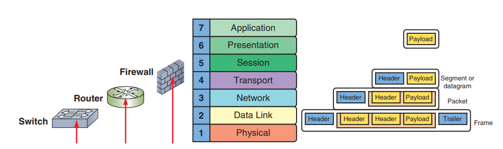
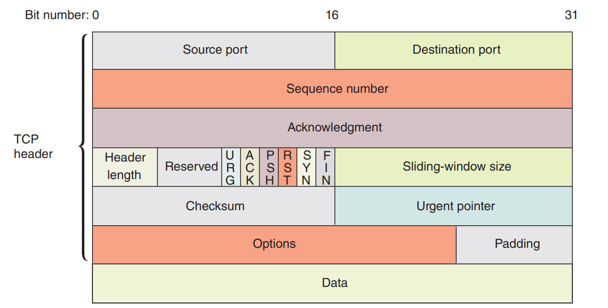
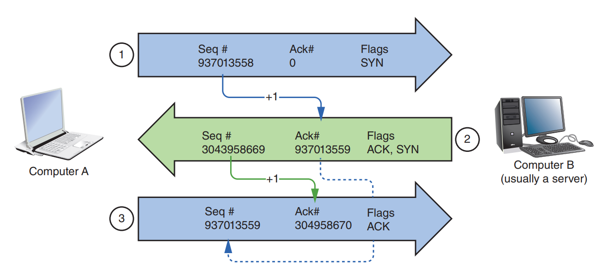
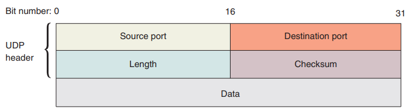
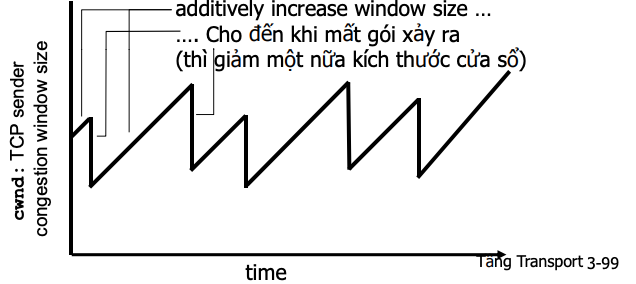
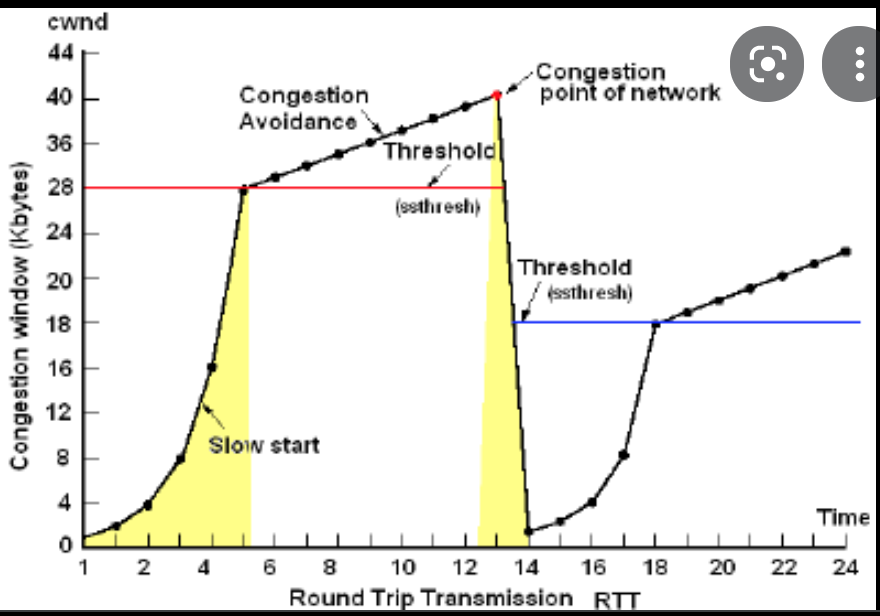
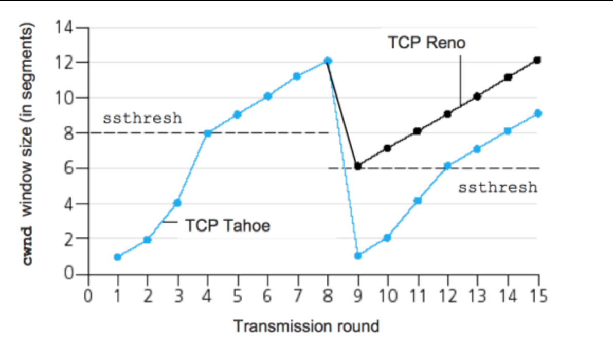

# **TCP/IP**
**TCP/IP** is a suite of protocols, or standards, that includes TCP, IP (IPv4 and IPv6), UDP,
ARP, and many others.

**Layer 4** : Tầng giao vận, là dịch vụ giữa tầng mạng và tầng ứng dụng, cung cấp các tiến trình thường sử dụng giao thức TCP và UDP. Các gói tin TCP/UDP bao gồm các port nguồn và port đích nhằm xác định đích gửi nhận của gói tin. Các message được phân mảnh khi gửi TCP và datagram khi gửi UDP (IP datagram là đơn vị truyền dữ liệu được đánh địa chỉ gửi nhận ở trong Header). 


> Các gói tin tầng 4 bao gồm payload và Header
## **TCP**
là giao thức hoạt động trong tầng giao vận của mô hình OSI.
TCP còn được được biết đến là giao thức truyền tin cậy, có tốc độ truyền thấp hơn UDP, và có những cơ chế để giúp nó truyền tin cậy, đảm bảo băng thông, đảm bảo độ trễ => thường sử dụng trong các ứng dụng tin nhắn, thông tin đăng nhập. 

**3 đặc điểm của TCP**
- *Connection-oriented*: Trước khi TCP truyền nhận data, được đảm bảo là đã kết nối, thiết lập connection (Established). TCP thực hiện cơ chế **bắt tay 3 bước** để thiết lập 1 kết nối TCP (establish TCP connection).
- *Sequencing and checksums*(Trình tự và kiểm tra): Ví dụ như trong khi gọi điện thoại : Người kia không nghe rõ bạn nói gì, thì họ sẽ checksums bằng cách "alo nghe mình nói gì không bạn êyy", và khi nếu bạn nghe thấy,thì theo sequencing thì bạn sẽ "Ôi bạn ơi, nghe rồi". Tương tự như vậy, TCP truyền 1 gói checksums đến kiểm tra xem nó có khớp trên máy nhận không, nếu không khớp -> chứng tỏ máy nhận nhận thiếu segment, và máy gửi sẽ gửi lại. Mỗi segments của gói tin đều được đánh sequence number để kiểm soát mất mát.
- *Flow control*: Ví dụ : thằng bạn của bạn nói quá nhanh và bạn phải kiểu "wait wait, tao chưa nghe rõ, you talk to quick, so make me mất mát 'gói tin'?". Do đó TCP cần sự kiểm soát quá trình truyền nhận. Ví dụ: máy gửi gửi 4000byte, và máy nhận sẽ được nhận từ từ 1500byte/lần và gửi lại cờ ACK cho máy gửi nếu nhận thành công.

Một gói tin TCP không thể gửi trong 1 lần vì vậy ngta buộc phải phân mảnh thành các TCP segments. Các segments này sau khi lên tầng application sẽ được đóng gói (encapsulate) thành IP packet:

> TCP segments - Data ở dưới cùng không thuộc TCP header

| Field | Length| Function | 
| ------------- | ------------- | ------------- |
| Source port | 16 bits  | Port nguồn  |
| Destination port | 16 bits  | Port đích |
| Sequence number | 32 bits | "Số thứ tự" của mỗi segments  |
| Acknowledgment number | 32 bits | Số xác nhận data gửi về là số sequence nào của segments |
| Header length | 4 bits  | Cho biết header dài bao nhiêu |
| Flags | 6 bits  | Các bit điều khiển các cờ ACK,SYN,FIN,RST |
| Window size | 16 bits  | Số bytes mà thiết bị sẵn sàng nhận |
| Checksum  | 16 bits  | kiểm tra lỗi của TCP segment |
| Urgent pointer | 16 bits  | Sử dụng trong trường hợp cần ưu tiên dữ liệu |
| Options | 0-32 bits  | Các tuỳ chọn đặc biệt, ví dụ maxium segment size (Mtu TCP) |
| Padding| variable  | Đảm bảo ràng size của TCP header là bội số của 32 bits |

**TCP bắt tay 3 bước**

> Cơ chế bắt tay 3 bước 

Đầu tiên khi ta gõ vào trình duyệt là http://xgoogle.com 

***Step 1***:  Cờ SYN được gửi từ A-B mang những thôn tin sau :

- Khởi tạo số Seq (sequence) (93..58) . Được randoms.
- Cờ SYN : Máy A said :"Tao muốn kết nối với m B ơi :D ", và chờ B phản hồi
- Cờ ACK : set bằng 0 vì lần đầu giao tiếp chưa nhận được gì từ B

***Step 2***: Cờ SYN/ACK được gửi B-A

- SYN/ACK : được set . Máy B said : "Ok kết nối đi mày, tao confirm"
- ACK : bằng số Seq trước + 1 = 93..59. Và máy B mong là cái segment sau khi A-B thì số Seq sẽ là 93..59
- Seq của B : 30..69 được randoms ra để gửi

***Step 3***:  Cờ ACK (connection established) - sự confirm từ máy A

- Số Seq : 93..59 vì ACK của máy B yêu cầu.
- ACK : bằng số Seq B gửi + 1 = 30..70

Và thế là connection được established. Các gói sau đó sẽ gửi data.

```
Note: ISN (Initial Sequence Number) : là cái số Seq mà cờ SYN đầu tiên gửi đấy bro. Hiểu là được random tuy nhiên nó có cách tính đặc biệt dựa vào đồng hồ của os.
Và vì sao lại cộng 1 vào ACK. vì là số Seq sẽ tăng lên bằng số bits mỗi segments nhận. Ví dụ : A gửi đến B gói tin 725 bits. thì ở Step 2 ACK sẽ là : 93..58 + 725 = 93..84. Và B mong là gói tiếp theo sẽ nhận được số Seq = 93..84
```
## **UDP** (User datagram Protocol)

là giao thức truyền không đáng tin cậy. Vì nó không có quá trình kết nối trước khi gửi dữ liệu. Phù hợp với ứng dụng streaming, videos, youtube => vì tốc độ nhanh và thi thoảng có mất 1 gói bé xíu xíu thì cũng không ảnh hưỏng mấy. Chứ bro nghĩ thử xem nếu mà gửi tin nhắn "Anh phải nhắc em" thành "Anh ph ắc em" xem.

- Không có cơ chế phục hồi dữ liệu. flow control các thứ như TCP. 
- Không đảm bảo truyền dữ liệu. Cứ truyền thôi có đến đích hay không thì kệ.
- Nhanh và hiệu quả hơn đối với các dữ liệu có kích thước nhỏ và yêu cầu khắt khe về thời gian.


> A UDP datagram

- Length : cho biết chiều dài của toàn bộ UDP datagram tổng cộng bao nhiêu byte.(16 bit thì sẽ có tổng cộng 2^16 byte = 65536 giá trị (từ 0 -> 65535 byte))
- Checksum : sử dụng thuật toán mã vòng CRC để kiểm lỗi cho toàn bộ UDP datagram và chỉ kiểm tra một cách hạn chế

Cách hoạt động UDP :
UDP hoạt động tương tự như TCP nhưng nó không cung cấp kiểm tra lỗi khi truyền gói tin.

Khi một ứng dụng sử dụng UDP, các gói tin chỉ được gửi đến người nhận. Người gửi không đợi để đảm bảo người nhận nhận được gói tin hay không, mà tiếp tục gửi các gói tiếp theo. Nếu người nhận miss mất một vài gói tin UDP thì gói tin đó coi như bị mất vì người gửi sẽ không gửi lại chúng. => Các thiết bị có thể giao tiếp nhanh hơn.


# Advance TCP :
:v advance hơn 1 tý thui hehe. ._. cũng ko advance lắm đọc trong - Mạng máy tính Hồ Đắc Phương
## TCP congestion avoidance (Kiểm sóat tắc nghẽn)
Kiểm soát luồng :
Các bên có cửa sổ kiểm soát :
- Rwnd : cửa sổ nhận
- Cwnd : Cửa số kiểm soát tắc nghẽn
- RTT : Round Trip Time : khoảng thời gian mà segment được gửi và nhận ACK.

Khi nào tắc nghẽn xảy ra : 
- Nhiều cặp gửi-nhận
- Truyền quá nhiều làm cho mạng quá tải

Hậu quả cảu tắc nghẽn mạng là : 
- Mất gói tin
- Thông lưọng giảm, độ chễ tăng

***Nguyên lý cơ bản kiểm soát tắc nghẽn*** :
- Trạm đầu cuối của các segment TCP được điều chỉnh theo tình trạng của mạng theo dõi được.
- ACK được dùng để điều phối tốc độ gửi nhận TCP

=> Mục đích là tìm được số segment nhiều nhất được gửi đi trong mỗi RTT, để tăng tốc độ đường truyền, mà không làm drop gói tin.

### **AIMD (Additive Increase / Multiplicative Decrease)**

- Source host TCP sở hữu : cwnd
- Destination host TCP sở hữu : rwnd
```
Max_window = min(cwnd, rwnd)
Effective window = Max_window - (LastByteSent - LastByteAcked)
```

Hướng tiếp cận : Bên gửi sẽ tăng tốc độ truyền lên (tăng kích thước cửa sổ nghẽn cwnd) nhằm thăm dò băng thông sử dụng, cho đến khi mất gói xảy ra :


- ADditive Increase (Tăng theo cấp số cộng): tăng cwnd lên 1 Mss sau mỗi RTT cho đến khi mất gói xảy ra.
- Multiplicative Decrease (Giảm theo cấp số nhân): giảm 1 nửa cwnd sau mỗi lần xảy ra mấy gói. 

> Đồ thị cwnd trong qúa trình AIMD

Bên gửi sẽ giới hạn truyền tải bằng cách :
```
LastByteSent - LastByteAcked < rwnd
rate =  cwnd/RTT (bytes/sec)
```
*`(Công thức này cho trường hợp nào đó :D mình chưa gặp nên cũng chưa rõ để làm gì, các sách cũng nói khá qua loa đoạn rate này)`*

Vào phần chính :D : Congestion control thường có 2 dạng :

- End - End congestion control : Điều khiển tắc nghẽn dựa trên 2 host. Các thông số về congestion sẽ được suy ra từ số lượng các gói tin bị mất trong quá trình truyền.
- Network - assited congestion control : Router cung cấp bit cho sender host yêu cầu host ngừng đẩy dữ liệu, rate (là cái rate bên trên đó :D ) gửi tới các host.

### **Congestion control thực hiện với các cơ chế :** 


- **Slowstart** : Ban đầu sẽ gửi đi 1 datagram thiết lập cwnd =1, khi nhận được ACK thì tăng lên 2, và sau đó tăng theo hàm mũ 2. VD : 2, 4, 8, 16...
    - Đến khi xảy ra mất gói tin : sẽ set ssthresh = cwnd/2, cwnd = 1, cwnd lại tăng theo slowstart.
    - TCP nhận biết khi nào mất gói tin bằng cách : RTO (retransmission timeout) or duplicate ACK.
    - Khi mà (lần 2) cwnd > ssthresh : Bước vào giai đoạn Congestion Avoidance.
    - Khi mà gặp "duplicate ACK" : Bước vào giai đoạn Fast Retransmit hoặc Fast Recovery.
- **Congestion Avoidance** : 
    - Đây là giai đoạn khi mà đã có ssthresh : lúc này cwnd tăng theo hàm tuyến tính sau mỗi RTT chứ không tăng theo hàm mũ nữa, có thể là cwnd + a.
- **Fast Retransmit** : (Khi có triple ACK)
    - Đặt ngưỡng ssthresh = cwnd/2. Và cwnd = 1 -> quay lại slowstart
- **Fast Recovery** : (Khi có triple ACK)
    - Truyền lại 3 gói tin đã mất khi có triple ACK
    - Khi nhận được ACK của gói bị mất -> chuyển sang congestion avoidance. Sau đó nếu timeout thì quay lại slowstart.


> Slowstart and Congestion avoidance

### **Tahoe and Reno**

**Thụât toán TCP Tahoe** : Gồm Slowstart, Congestion avoidance, Fast retransmit
- Slowstart đến khi xảy ra timeout
- Chuyển qua Congestion avoidance
- Khi triple ACK => Fast Retransmit : giảm cwnd = 1 => bắt đầu slowstart lại 

**Thụât toán TCP Reno** : Gồm Slowstart, Congestion avoidance, Fast retransmit
- Slowstart đến khi xảy ra timeout
- Chuyển qua Congestion avoidance
- Khi triple ACK => Fast Recovery : 
    - giảm cwnd = cwnd/2 
    - ssthresh = cwnd
    - Truyền lại gói đã mất và congestion avoidance


> Tahoe and Reno

```
Nhận xét thì thụât toán Reno gíúp làm tăng số lượng gói được gửi đi nhanh hơn so với Tahoe. khi mà gặp triple ACK thì cwnd chỉ giảm 1 nửa trong khi tahoe cwnd phải giảm về 1.
```

--- 
> Author : dangdh11

> Reference :
- TCP/IP Illustrated Volume 1 - W.Richard Stevens
- Network + guide to network Eight Edition - Jill West, Jean Andrews
