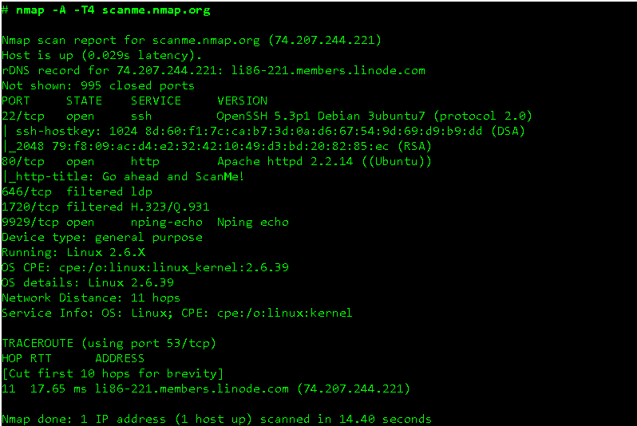

# **Nmap**
là một công cụ quét mạng với mã nguồn mở

## Cách thức hoạt động
Nmap quét IP dựa các gói tin theo những cách đặc biệt để có thể xác định các host trên một hệ thống mạng, để rồi từ đó xác định xem những services đang chạy, hệ điều hành, bộ lọc các gói tin, tường lửa đang sủ dụng là gì.
## Tính năng của Nmap
- Phát hiện, khai thác lỗ hổng bảo mật
- Phát hiện ra backdoor
- Quét các máy chủ và port trên máy chủ trên hệ thống
- Xác định hệ điều hành, service, firewall
- Cung cấp thông tin về loại thiết bị, DNS, Mac address
- Thực thi các đoạn script NSE hoặc Lua

## Thông tin output

STATE :
- Open: Có dịch vụ đang thực hiện public, ko firewall
- Closed: Máy victim vẫn nhận và phản hồi, nhưng không có service nào chạy trên port đó
- Filtered: Đã có sự ngăn chặn bởi firewall
- Unfiltered: Không bị firewall chặn nhưng mà không biết là cổng đó đóng hay mở ( cùi vãi :v)
- Open/Filtered: Khi mà thằng Nmap không biết cái này đang Open hay Filtered :v . Nó bị kiểu dù port mở nhưng mà không có response.
- Closed/Filtered: Khi mà thằng Nmap không biết cái này đang Closed hay Filtered :v 
## Command
### ***Basic command***
- `nmap scanme.nmap.org`
- Xác định Os của host: `nmap -O scanme.nmap.org`
- Scan port 80: `nmap -p 80 scanme.nmap.org`
- Scan TCP: `nmap -sT scanme.nmap.org`
- Scan UDP: `nmap -sU scanme.nmap.org`
### ***Host discovery***
- Scan a single target: `nmap 192.168.0.1`
- Scan multiple targets: `nmap 192.168.0.1 192.168.0.2`
- Scan theo list: nmap -iL targets.txt
- Scan dải ip: nmap 192.168.0.1-10
- Scan subnet: `nmap 192.168.0.1/24`
- Scan Random Hosts	nmap: `nmap -iR 0`
- Loại trừ khỏi mục tiêu quét: `nmap 192.168.0.1/24 –exclude 192.168.0.100, 192.168.0.200`
- Loại trừ trong file: `nmap 192.168.0.1/24 –excludefile notargets.txt`
- Scan: `nmap -A 192.168.0.1`
- Scan IPv6: `nmap -6 1aff:3c21:47b1:0000:0000:0000:0000:2afe`
### ***Port scanning***
- Scan nhanh: `nmap -F 192.168.1.5`
- Scan port : `nmap --p 21-25,80,139,8080 192.168.1.5`
- Scan port thep thên: `nmap -p ftp,http* 192.168.1.5`
- Scan port theo giao thức T:TCP, U:UDP: `nmap -sU -sT 192.168.1.5`
    - `-sS` TCP SYN scan: Để lấy thông tin và không hoàn thành connection TCP do đó làm giảm nghi ngờ phía máy chủ 
    - `-sT` TCP scan: Thông tin được lấy detail hơn và có tạo connection với máy host => mất thời gian hơn SYN
    - `-sU` UDP scans: Dùng UDP để scan các dịch vụ DNS, DHCP, SNMP port. Những port mà có thể xảy ra các tấn công The man in the middle. => hữu ích
    - `-sY` SCTP INIT scan: Scan các dịch vụ SS7, SIGTRAN. Loại này cũng tránh nghi ngờ quét mạng vì chưa thực hiện quá trình SCTP.
    - `-sN` TCP NULL: Đại khái là option này khá magic, nó dựa trên các lỗ hổng của TCP, để quét ra các thông tin của TCP mặc dù có bị firewall chặn. *- Đọc các docs đẻ tìm cơ chế nhưng vẫn chưa ra*
- Scan all port: `nmap -p ‘*’ 192.168.1.5`
- Scan những 1 số port quan trọng: `nmap -top-port 10 192.168.1.5`
### ***Version detection***
- Detect Os: `nmap -O 192.168.1.5`
- Đoán Os: `nmap -O –osscan-guess 192.168.1.5`
- Detect các service đang chạy: `nmap -sV 192.168.1.5`

### ***Scriptable interaction with the target***

### **Bypass firewall** *(1 số cách đã thử)*

Thì dùng trong trường hợp mà các cách check bên trên không filter ra thông tin, thì thử thêm các trường này vào, để có thể bypass. theo thứ tự từ trên xuống. Các option như là MTU. source port, lengthdata thì phải có thông tin.
- Giả địa chỉ MAC : `nmap –spoof-mac Cisco 192.168.1.5`
- Fragment Packets : `nmap -f 192.168.1.5`
- Chỉ định MTU: `nmap –mtu 32 192.168.1.5`
- Chỉ đinh port nguồn(sender): `nmap –source-port 1025 192.168.1.5`
- Thêm dữ liệu ngẫu nhiên: `nmap –data-length 20 192.168.1.5`
- Gửi checksums : `nmap –badsum 192.168.1.5`

### **Usecase**:
- Scan dải ip: Xem ip nào UP DOWN, và thông tin được xuất ra file các port của host đó
    - `nmap -oG - 192.168.1.0-255 -vv >> output.txt`
- Chỉ định port 22
    - `nmap -oG - 192.168.1.0-255 -p 22 -vv >> output.txt`
- Nếu dùng nmap <host_ip>, mà không có thông tin gì trả về, tức là đã bị firewall nhé. Thì lúc đó ta thêm 1 số trường "Bypass firewall" vào:
    - `nmap –spoof-mac Cisco viblo.asia`
- Xem toàn bộ thông tin trên server, các service gì đang chạy trên port nào, port nào đang có firewall.
    - `nmap -sC -sV -O -spoof-mac Cisco lotteria.vn`
    - (sV : services version)
---
>author : dangdh11

>reference : https://hackersonlineclub.com/nmap-commands-cheatsheet/

udating...
