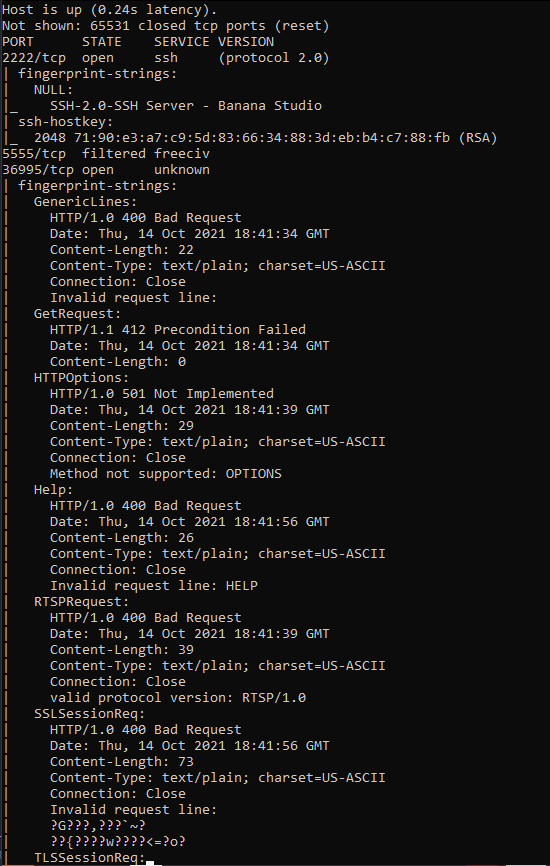
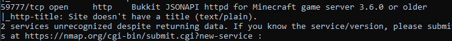
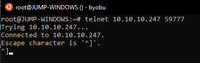
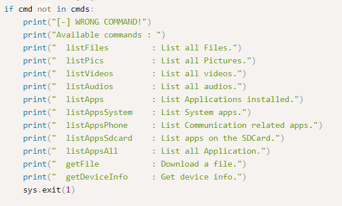
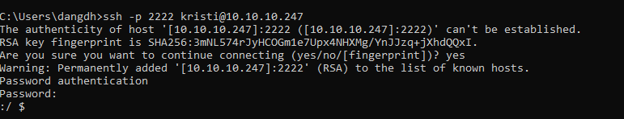

# **Explore**

Đầu tiên là truy cập thử xem có port 80 ko :V có phải trình duyệt ko này.
Xong cũng là scan bằng nmap và gobuster thôi :D
```
nmap -sC -p- -sV -T3 -Pn -v 10.10.10.247
```

Scan port khá lâu mới ra được vài port này:


```
2222
5555
36995
59777
```
Có thể tra thông tin các port trên trang: https://www.speedguide.net/

Đầu tiên quét nmap ra thì không có thông tin port `2222`, nên nghĩ nó là port gì đó. Mà magic gì đó quét lại nmap lần nữa thì nó ra ssh => nên chắc là port ssh.

Và kiểu hình như các port đều dính tới Android => chắc là điện thoại. :D 

Và ảo thật đếy, mất cả tối để truy cập port `36995` mà không để ý tới `59777`
Sau đó tra đến ông `59777` thì ối dời ơi :v ra ngay quả CVE có cả detail hướng dẫn, thường mấy bài machine kiểu này mà ra mấy port xấu xấu mà tra ra cve kiểu gì cũng dùng cve đó để exploit được. https://github.com/fs0c131y/ESFileExplorerOpenPortVuln Theo mô tả thì là, có thể xâm nhập máy victim qua port này.

Thơm :v mình telnet thử phát cho ló chắc:



Thấy ok rùi thì mình down script về chạy thử xem có gì ko ._.
https://www.exploit-db.com/exploits/50070

Đọc qua script thì có 1 vài tùy chọn nha:


Mình thử getfile và getdeviceinfo xem có gì ko, :v Đầu tiên phải list nó ra trước
```
python3 exploit59777.py listFiles 10.10.10.247
python3 exploit59777.py listApps 10.10.10.247
python3 exploit59777.py listVideos 10.10.10.247
python3 exploit59777.py listPics 10.10.10.247

python3 exploit59777.py getFile 10.10.10.247
```
Sau khi tải file và ảnh về về chuyển thành jpg thì có 1 ảnh đẹp ở đây cần chú ý:

> Với port ssh ở trên thì mình dùng đúng tài khoản và password này ssh vào thử

```
ssh -p 2222 kristi@10.10.10.247
```

Khi đã truy cập được server rồi, thì giờ là đến phần hay nhất rồi: Privilige escalation. Tuy nhiên vẫn chưa làm ra :v. updating