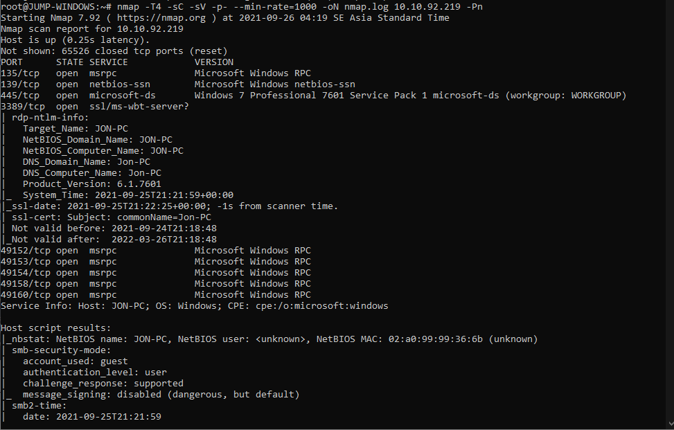
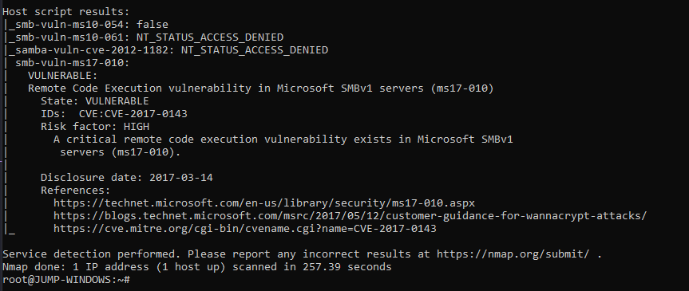

# **Blue**
## 1. Recon

> Mình lại dùng nmap để scan

```
nmap -T4 -sC -sV -p- --min-rate=1000 -oN nmap.log 10.10.92.219 -Pn
```
Bình thường sử dụng -sC nmap sẽ mặc định chạy những script default vì trong tập lib của nmap nhiều script mang tính xâm nhập tấn công, nên ko set default.

Để scan được vulneribility ta dùng `--script vuln`
```
nmap -T4 --script vuln -sV -p- --min-rate=1000 -oN nmap.log 10.10.92.219 -Pn
```

> Kết quả là có lỗi RCE ms17-010

## 2. Gain Access
*Lưu ý là trước khi làm bước này cần phải biết Metasploit*